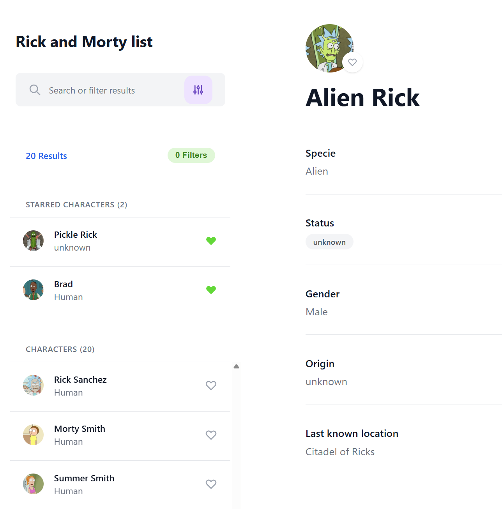
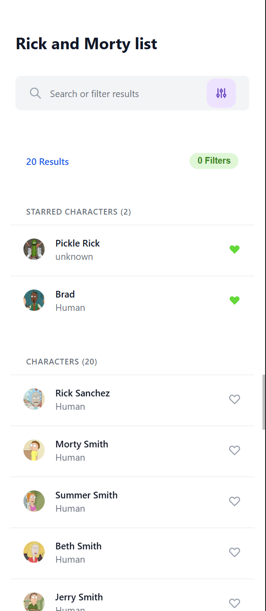

# 🌀 Rick and Morty Explorer

A **PHP 8+** application that consumes the **Rick and Morty API** and displays characters in a responsive interface built with **Tailwind CSS**, without using any PHP frameworks.

The project follows a **component-based architecture**, uses **PSR-4 autoloading**, and includes features such as **search, filters, favorites, infinite scrolling, and responsive layouts**.

---

## 📸 Preview

### Desktop



### Mobile



---

# 🚀 Getting Started

## Prerequisites

* PHP 8.0+
* Composer
* Node.js & npm

## 📦 Installation

### Option 1 (Recommended) — XAMPP

Clone the repository inside your XAMPP `htdocs` directory:

```bash
cd C:\xampp\htdocs

git clone https://github.com/jhoan2706/rick-and-morty-app.git
cd rick-and-morty-app

composer install
npm install
npm run build-css
```

Start **Apache** from the XAMPP Control Panel.

Then open:

```text
http://localhost/rick-and-morty-app/
```

---

### Option 2 — PHP Built-in Server

After installing the dependencies, run:

```bash
php -S localhost:8000
```

Then open:

```text
http://localhost:8000
```

# 🛠 Tech Stack

* PHP 8+
* Tailwind CSS 3
* Vanilla JavaScript
* Composer (PSR-4)
* cURL
* Rick and Morty REST API

---

# ✨ Features

* 🃏 Browse Rick and Morty characters
* 🔍 Search characters by name
* 🎯 Filter by species and character type
* ⭐ Favorite / unfavorite characters
* 💾 Favorites persisted with LocalStorage
* 🚀 Infinite scrolling
* 📱 Responsive desktop and mobile layouts
* 📄 Dedicated mobile detail page
* ⚡ Smart cache for favorite characters
* 🧩 Component-based architecture
* ❌ Empty state handling
* ⚠️ Error handling for failed API requests

---

# 🎯 Bonus Features

* ⭐ Favorites system with persistence
* 🚀 Infinite Scroll
* 💾 Cached favorite characters
* 📱 Mobile detail page (`detail.php`)
* 🎨 Pixel-perfect implementation based on the provided Figma design

---

# 📁 Project Structure

```text
rick-and-morty-app/
├── index.php
├── detail.php
├── api/
│   └── characters.php
├── config/
│   └── config.php
├── src/
│   ├── Components/
│   │   ├── CharacterCard.php
│   │   ├── CharacterDetail.php
│   │   ├── CharacterList.php
│   │   ├── CharacterListItem.php
│   │   ├── LoadingSpinner.php
│   │   ├── Pagination.php
│   │   ├── SearchBar.php
│   │   └── SearchFilters.php
│   ├── Services/
│   │   └── RickAndMortyAPI.php
│   └── Utils/
│       └── Helpers.php
├── assets/
│   ├── css/
│   │   └── tailwind.css
│   └── js/
│       └── app.js
├── tailwind.config.js
├── postcss.config.js
├── composer.json
├── package.json
└── README.md
```

---

# 📡 API Reference

Base URL

```text
https://rickandmortyapi.com/api
```

Endpoints used:

| Method | Endpoint                       | Description         |
| ------ | ------------------------------ | ------------------- |
| GET    | `/character`                   | Retrieve characters |
| GET    | `/character?page={page}`       | Pagination          |
| GET    | `/character?name={name}`       | Search              |
| GET    | `/character?species={species}` | Filter by species   |
| GET    | `/character?status={status}`   | Filter by status    |
| GET    | `/character?gender={gender}`   | Filter by gender    |

Documentation:

[https://rickandmortyapi.com/documentation](https://rickandmortyapi.com/documentation)

---

# ✅ Technical Requirements

* ✅ PHP 8+ (no framework)
* ✅ Tailwind CSS
* ✅ REST API integration
* ✅ Responsive layout
* ✅ Search functionality
* ✅ Character filters
* ✅ Infinite scrolling
* ✅ Favorites system
* ✅ LocalStorage persistence
* ✅ Component-based architecture
* ✅ PSR-4 autoloading
* ✅ Error handling
* ✅ Empty states

---

# 👨‍💻 Author

**Gonzalo Gutierrez**

📧 [gonzalo2706@gmail.com](mailto:gonzalo2706@gmail.com)

GitHub:
[https://github.com/jhoan2706](https://github.com/jhoan2706)

---

*Built for the Blossom Technologies technical assessment.*